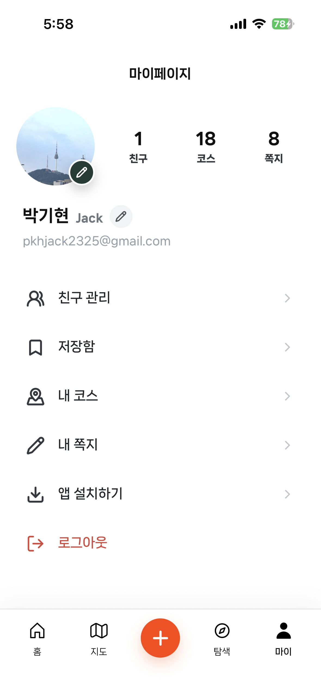

# Local Enjoy Trip Backend

Spring Boot 기반 국내 여행 플랫폼 백엔드.

## 서비스 화면

| 홈 | 지도 | 코스 탐색 |
|:---:|:---:|:---:|
|  |  |  |

| 마이페이지 | 친구 관리 |
|:---:|:---:|
|  |  |

## 유스케이스 다이어그램

| 인증 | 관광지·노트 |
|:---:|:---:|
|  |  |

| 코스 | 소셜·관리 |
|:---:|:---:|
|  |  |

## ERD


## 클래스 다이어그램


## WBS


## 요구사항 명세서

- [요구사항 명세서](docs/project/gotgot-requirements.md)

## 기술 스택

- **Framework**: Spring Boot 4.0.6, Spring MVC
- **Persistence**: MyBatis, PostgreSQL/PostGIS, pg_vector
- **Cache/Storage**: Redis, MinIO
- **Verification**: Testcontainers
- **Ops/Monitoring**: Prometheus, Grafana, OpenTelemetry, Caddy

## 프로젝트 구조

```text
.
├── core
│   ├── core-api       # Spring Boot 메인 실행 모듈 (API, Scheduled Job)
│   └── core-enum      # 공통 Enum 모듈
├── storage
│   └── db-core        # MyBatis Mapper, Record, DB 설정, Migration
├── external           # 외부 API 클라이언트 (MinIO, GMS 등)
├── batch              # Spring Batch 실행 모듈
├── support
│   ├── logging        # 로깅 설정 지원
│   └── monitoring     # 모니터링 설정 지원
├── infra              # 인프라 설정 (Docker Compose, Prometheus, Grafana 등)
└── docs               # 설계 및 문서화 자료
```

## 모듈 구조

| 모듈 | 설명 |
|---|---|
| `core/core-api` | Spring Boot 메인 실행 모듈. HTTP API와 scheduled job을 단일 런타임에서 실행 |
| `core/core-enum` | `core-api`와 `storage/db-core`가 공유하는 enum 전용 모듈 |
| `storage/db-core` | MyBatis mapper/XML, storage Record, Flyway migration |
| `external` | 외부 API, AI, MinIO 연동 구현 |
| `batch` | 수동/offline Spring Batch 런타임 |
| `support/logging` | 로깅 런타임 지원 리소스 |
| `support/monitoring` | 모니터링 런타임 지원 리소스 |

메인 클래스: `com.ssafy.enjoytrip.EnjoyTripApplication`

## 로컬 실행

### 사전 준비

- Java 25
- Docker & Docker Compose

### 의존 서비스 구동

```bash
docker compose up -d
```

PostgreSQL, Redis, MinIO, Grafana 스택을 포함한다.

### API 서버 실행

```bash
./gradlew :core:core-api:bootRun
```

OpenTelemetry Java agent와 함께 실행:

```bash
./gradlew :core:core-api:bootRunOtel
```

`infra/agent/opentelemetry-javaagent.jar`를 자동으로 준비하며 기본 OTLP endpoint는 `http://localhost:4318`이다.
IntelliJ에서는 `.run/Core API OTel.run.xml` 실행 구성을 사용한다.

### 프론트엔드 실행

```bash
# 프론트엔드 저장소로 이동 후
npm install
npm run dev
```

### 빌드 및 검증

```bash
./gradlew :core:core-api:check
./gradlew :storage:db-core:check
./gradlew :core:core-api:bootJar
```

빌드 산출물:
- `core/core-api/build/libs/core-api-1.0.0-SNAPSHOT.jar`
- `core/core-api/build/docs/asciidoc/index.html`

## 환경변수

`.env.example`을 `.env`로 복사한 뒤 값을 채워 사용한다.

| 변수 | 설명 |
|---|---|
| `ENJOYTRIP_DB_URL` | JDBC 연결 URL |
| `ENJOYTRIP_DB_USER` | DB 사용자 |
| `ENJOYTRIP_DB_PASSWORD` | DB 비밀번호 |
| `ENJOYTRIP_MINIO_ENDPOINT` | MinIO 엔드포인트 |
| `ENJOYTRIP_MINIO_ACCESS_KEY` | MinIO 액세스 키 |
| `ENJOYTRIP_MINIO_SECRET_KEY` | MinIO 시크릿 키 |
| `GMS_KEY` | AI 브리핑용 GMS API 키 |
| `ENJOYTRIP_OAUTH2_GOOGLE_CLIENT_ID` | Google OAuth 클라이언트 ID |
| `ENJOYTRIP_OAUTH2_GOOGLE_CLIENT_SECRET` | Google OAuth 클라이언트 시크릿 |
