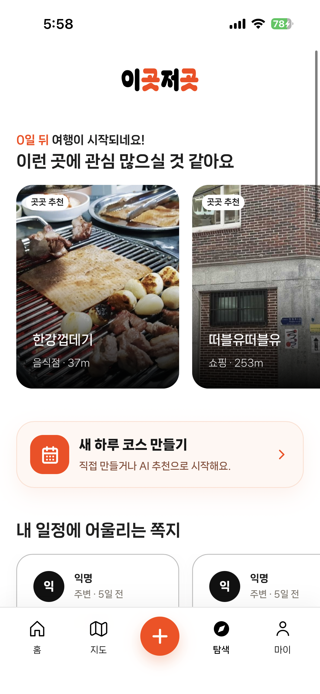
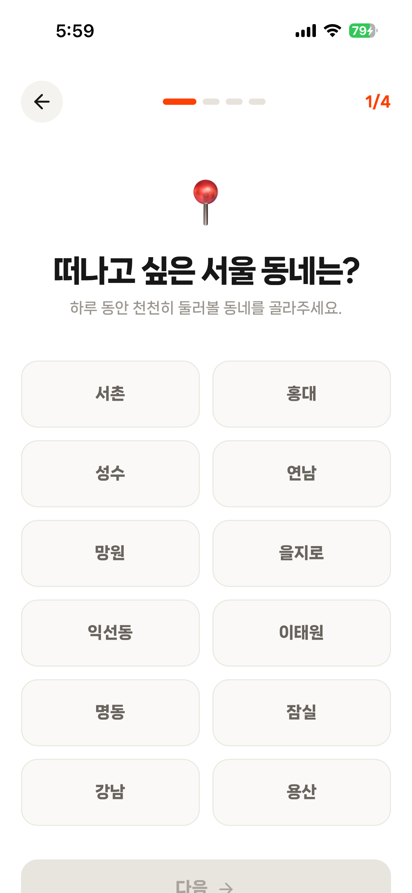
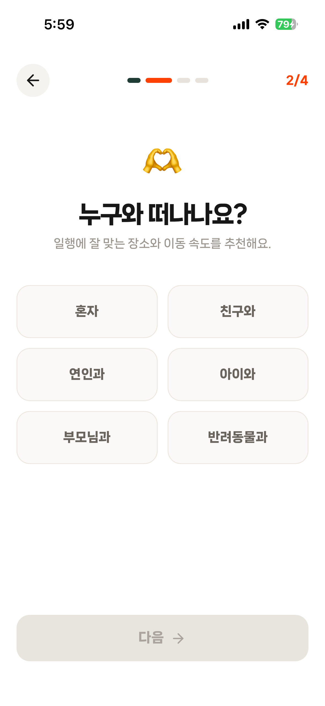
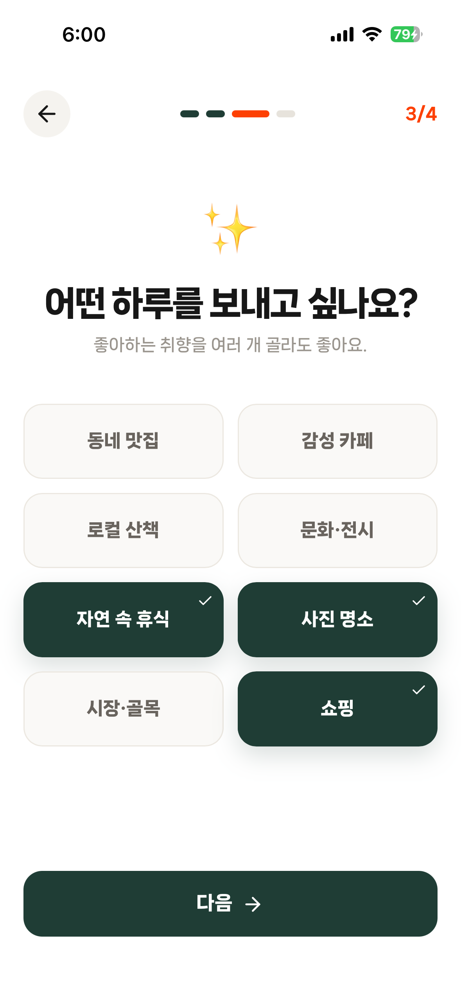
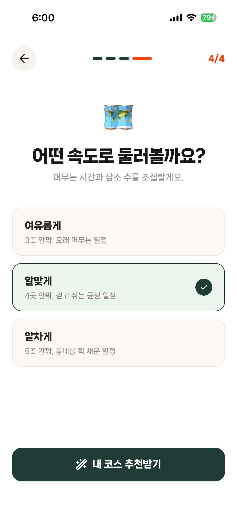
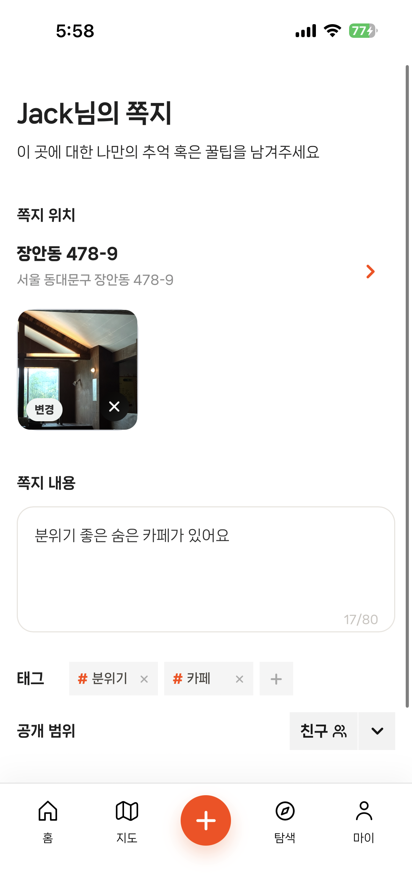

# Local Enjoy Trip Frontend

React 기반 지도 중심 로컬 여행 코스 추천 서비스 **곳곳**의 프론트엔드입니다.

곳곳은 단순히 장소를 찾는 지도가 아니라, 사용자가 실제로 **어디서, 언제, 어떻게 즐길지**까지 이어주는 로컬 경험 추천 서비스입니다.  
사용자는 원하는 지역, 동행자, 취향, 이동 속도를 선택해 하루 코스를 추천받을 수 있고, 장소에 대한 개인적인 추억이나 팁을 쪽지 형태로 남길 수 있습니다.

---

## 서비스 화면

<table>
  <tr>
    <td align="center">홈</td>
    <td align="center">탐색</td>
    <td align="center">코스 생성 1단계</td>
    <td align="center">코스 생성 2단계</td>
  </tr>
  <tr>
    <td></td>
    <td></td>
    <td></td>
    <td></td>
  </tr>
  <tr>
    <td align="center">코스 생성 3단계</td>
    <td align="center">코스 생성 4단계</td>
    <td align="center">쪽지 작성</td>
    <td align="center">마이페이지</td>
  </tr>
  <tr>
    <td></td>
    <td></td>
    <td></td>
    <td></td>
  </tr>
</table>

---

## 주요 기능

### 홈

- 사용자 위치 기반 추천 장소 표시
- 날씨, 시간대, 현재 위치를 고려한 로컬 브리핑 제공
- 일정에 어울리는 로컬 쪽지 추천
- 새 하루 코스 만들기 진입
- 홈 위치 설정 및 서울 행정동 선택

### 탐색

- 사용자의 일정과 관심사에 맞는 장소 추천
- 추천 장소 카드 UI 제공
- AI 추천 코스 생성 플로우 진입
- 내 일정에 어울리는 쪽지 탐색

### 지도

- Kakao Map 기반 장소 마커 표시
- 지도 마커와 BottomSheet 선택 상태 동기화
- 장소 카드, 선택 마커, 상세 정보 연결
- 현재 위치 / 카테고리 / 필터 기반 지도 탐색
- Kakao CustomOverlay 기반 마커 및 클러스터 렌더링

### AI 코스 추천

- 지역, 동행자, 취향, 속도 조건 기반 코스 생성
- AI Provider 기반 추천 결과 생성
- live model 실패 또는 토큰 미설정 시 Mock/Fallback 추천 제공
- AI 응답 schema 검증
- 추천 stop의 `attractionId`가 실제 상세 API와 2개 이상 매칭될 때만 저장 버튼 활성화

### 쪽지

- 장소에 대한 개인 경험, 팁, 사진, 태그 작성
- 공개 범위 설정
- 지도 기반 위치 선택
- 내 쪽지 관리

### 마이페이지

- 프로필 정보 확인
- 친구 관리
- 저장함
- 내 코스
- 내 쪽지
- 앱 설치 진입

---

## 기술 스택

| 영역 | 기술 |
|---|---|
| Framework | React, TypeScript, Vite |
| Routing | React Router |
| Server State | TanStack Query |
| Client State | Zustand |
| Map | Kakao Map JavaScript SDK |
| Styling | CSS, Mobile-first UI |
| AI Course | AI Provider, Mock Provider, Fallback Provider |
| Test | Playwright |
| Quality | ESLint, TypeScript Build |
| Accessibility | aria-label, aria-current, aria-pressed, focus-visible |

---

## 프로젝트 구조

```text
.
├── e2e                         # Playwright E2E smoke test
│   └── core-smoke.spec.ts
├── public
│   └── data                    # 정적 지도 데이터
├── src
│   ├── app                     # 앱 초기화 및 라우팅 진입점
│   ├── pages                   # 라우트 단위 페이지
│   ├── features
│   │   ├── ai-course           # AI 코스 추천 Provider / Schema / Fallback
│   │   ├── map                 # Kakao Map, marker, cluster, overlay
│   │   ├── notes               # 쪽지 UI 및 도메인 로직
│   │   ├── course              # 코스 생성 및 결과
│   │   └── user                # 사용자/마이페이지 관련 기능
│   ├── shared
│   │   ├── api                 # API client 및 mock API
│   │   ├── components          # 공통 UI 컴포넌트
│   │   ├── data                # mock data
│   │   ├── styles              # 전역 스타일
│   │   └── utils               # 공통 유틸
│   └── main.tsx
├── docs                        # 문서 및 화면 캡처
├── package.json
└── vite.config.ts
```

---

## 핵심 개선 사항

### 1. Route Code Splitting

정적 page import를 `React.lazy`와 `Suspense` 기반 dynamic import로 전환해 라우트별 chunk가 생성되도록 개선했습니다.

| 항목 | Before | After | 개선 |
|---|---:|---:|---:|
| Initial entry JS | 716.24 kB | 416.11 kB | 41.9% 감소 |
| Initial entry JS gzip | 218.30 kB | 134.39 kB | 38.4% 감소 |

- Vite 500kB chunk warning 제거
- `lazyPage`, `routeElement` helper로 중복 lazy 처리 정리
- 전체 JS 총량은 chunk 분리 오버헤드로 일부 증가할 수 있어, 성과 표현은 “초기 entry chunk 감소”로 제한

---

### 2. 지도 클러스터 계산 최적화

`clusterPoints`에서 매번 새 배열을 생성하던 구조를 push 누적 방식으로 변경했습니다.

또한 클러스터 중심 좌표 계산 시 `reduce` 2회 순회 대신 그룹 생성 중 `latTotal`, `lngTotal`을 함께 누적하도록 개선했습니다.

| 데이터 수 | Before | After | 개선 |
|---:|---:|---:|---:|
| N=200 | 0.0306ms | 0.0269ms | 12.1% 개선 |
| N=1,000 | 0.1282ms | 0.0954ms | 25.6% 개선 |
| N=5,000 | 0.6443ms | 0.3943ms | 38.8% 개선 |

> 위 수치는 synthetic point benchmark 기준입니다. 실제 지도 체감 성능은 Kakao overlay DOM 생성/삭제 비용의 영향도 함께 받습니다.

---

### 3. Kakao CustomOverlay 재사용

기존에는 지도 상태가 바뀔 때마다 모든 Kakao CustomOverlay를 제거한 뒤 다시 생성했습니다.

이를 `cluster:${id}`, `current-location` key 기반으로 저장하고, 위치가 같은 overlay는 재사용하면서 `content`, `class`, `zIndex`만 갱신하도록 개선했습니다.

| 상황 | 기존 | 개선 | 결과 |
|---|---:|---:|---|
| overlay 250개, 변경 없음 | 생성 250 + 제거 250 | 생성 0 + 제거 0 + 갱신 250 | 생성/제거 100% 제거 |
| overlay 250개, 10% 변경 | 생성 250 + 제거 250 | 생성 25 + 제거 25 + 갱신 225 | 생성/제거 90% 감소 |
| overlay 250개, 50% 변경 | 생성 250 + 제거 250 | 생성 125 + 제거 125 + 갱신 125 | 생성/제거 50% 감소 |

---

### 4. AI Provider / Mock / Fallback 구조

AI 코스 추천 기능은 외부 모델 응답과 토큰 상태에 영향을 받을 수 있습니다.

이를 위해 AI Provider를 분리하고, mock provider와 fallback provider를 구성했습니다.

```text
src/features/ai-course
├── generateCourse.ts
├── types.ts
├── providers
│   ├── aiCourseProvider.ts
│   ├── geminiCourseProvider.ts
│   └── mockCourseProvider.ts
└── schemas
    └── courseResponseSchema.ts
```

동작 방식:

- 기본은 server AI provider 호출
- `VITE_AI_COURSE_PROVIDER=mock`이면 mock provider 사용
- server AI timeout/error/schema 실패 시 fallback provider로 전환
- AI 응답 schema 검증
- 추천 stop의 `attractionId`가 실제 상세 API와 2개 이상 매칭될 때만 저장 버튼 활성화
- 토큰 또는 live model 응답이 없어도 결과 화면 유지

#### AI Mock / Fallback 화면


---

### 5. Playwright E2E Smoke Test

핵심 사용자 흐름이 리팩토링 이후에도 유지되는지 확인하기 위해 Playwright 기반 smoke test를 추가했습니다.

테스트 파일:

```text
e2e/core-smoke.spec.ts
```

검증 흐름:

```text
인증 세션 mock 주입
→ 홈 진입 후 사용자 인사 확인
→ 하단 내비게이션으로 탐색 이동
→ 코스 생성 패널 열기
→ AI 추천 코스 생성 단계 진행
→ AI 추천 결과 화면 확인
→ 쪽지 작성 화면에서 본문/태그 입력 확인
→ 마이페이지 이동 및 메뉴 확인
```

실행 결과:

```text
npm run test:e2e
1 passed (9.1s)
```


> 현재 E2E는 전체 회귀 테스트가 아니라 핵심 사용자 흐름 smoke test입니다.

---

### 6. 접근성 및 키보드 조작 개선

모바일 UI의 주요 조작 요소에 접근성 속성과 키보드 조작을 보강했습니다.

적용 대상:

- 하단 내비게이션
- 만들기 플로팅 메뉴
- 코스 생성 선택 카드 / 속도 카드 / 다음 버튼
- 쪽지 작성 태그 추가/삭제
- 공개 범위 메뉴
- 마이페이지 메뉴
- 지도 필터 / 카테고리 / 현재 위치 / 목록 / 지도 카드 버튼

적용 내용:

- 현재 페이지에 `aria-current="page"` 적용
- 주요 버튼에 `aria-label` 추가
- 선택 카드에 `aria-pressed` 추가
- 공개 범위 메뉴에 `aria-expanded`, `aria-haspopup`, `menuitemradio` 적용
- 지도 필터는 `group + aria-pressed` 구조로 의미 정리
- 전역 `button/a:focus-visible` outline 추가
- 선택 카드는 native `button` 기반으로 Enter/Space 조작 지원

---

## AI-assisted Development Workflow

AI에게 바로 구현을 맡기면 기존 구조를 충분히 파악하지 못한 채 파일을 수정하거나, 작업 범위 밖 리팩토링이 섞여 변경 원인을 추적하기 어려울 수 있습니다.

이를 방지하기 위해 다음 흐름을 적용했습니다.

```text
Researcher
기존 구조 조사
inspected files 기록
        ↓
Planner
작업 범위 / 리스크 / 하지 않을 것 정리
        ↓
Human Approval
승인 전 코드 수정 금지
        ↓
Implementer
승인된 파일만 수정
        ↓
Reviewer
diff / 회귀 위험 / 범위 이탈 검토
        ↓
Log
changed files / commands / review result 기록
```

실제 작업 문서와 로그는 `.ai/tasks`, `.ai/logs`로 관리했습니다.


---

## 로컬 실행

### 사전 준비

- Node.js 20.19+ 또는 22.12+ 권장
- npm
- 백엔드 API 서버 실행 필요
- Kakao Map JavaScript Key 필요

> Vite 7.x는 Node.js 20.19+ 또는 22.12+를 요구합니다.

### 의존성 설치

```bash
npm install
```

### 개발 서버 실행

```bash
npm run dev
```

### 프로덕션 빌드

```bash
npm run build
```

### 린트

```bash
npm run lint
```

### E2E 테스트

```bash
npm run test:e2e
```

Playwright report 확인:

```bash
npx playwright show-report
```

---

## 환경변수

`.env.example`을 `.env`로 복사한 뒤 값을 채워 사용합니다.

| 변수 | 설명 |
|---|---|
| `VITE_API_BASE_URL` | 백엔드 API 서버 주소 |
| `VITE_KAKAO_MAP_APP_KEY` | Kakao Map JavaScript Key |
| `VITE_AI_COURSE_PROVIDER` | AI 코스 provider 선택값. `server` 또는 `mock` |
| `VITE_APP_ENV` | 실행 환경 구분값 |

예시:

```env
VITE_API_BASE_URL=http://localhost:8080
VITE_KAKAO_MAP_APP_KEY=your-kakao-map-key
VITE_AI_COURSE_PROVIDER=mock
VITE_APP_ENV=local
```

---

## 백엔드 연동

백엔드는 별도 저장소에서 실행합니다.

```bash
docker compose up -d
./gradlew :core:core-api:bootRun
```

프론트엔드는 `VITE_API_BASE_URL`을 통해 백엔드 API와 통신합니다.

---

## 검증 결과

최근 검증 결과:

```text
npm run build
PASS

npm run lint
0 errors, 5 existing warnings

npm run test:e2e
1 passed (9.1s)
```

---

## 요약

- React.lazy/Suspense 기반 route code splitting으로 초기 entry JS gzip 크기 218.30 kB → 134.39 kB, 38.4% 감소
- 지도 클러스터 계산 로직에서 불필요한 배열 생성과 중복 순회를 제거해 5,000개 포인트 synthetic benchmark 기준 38.8% 개선
- Kakao CustomOverlay key 재사용 구조를 적용해 stable viewport 상호작용 시 overlay 생성/제거 작업 100% 제거
- AI Course Provider와 Mock/Fallback provider를 분리해 live model 실패 상황에서도 추천 결과 화면 유지
- Playwright smoke test로 홈 → 탐색 → 코스 생성 → AI 추천 결과 → 쪽지 작성 → 마이페이지 핵심 흐름 검증
- 주요 모바일 UI에 aria-label, aria-current, aria-pressed, focus-visible을 적용해 접근성과 키보드 조작 개선
- AI 작업을 Researcher → Planner → Approval → Implementer → Reviewer → Log 흐름으로 관리해 변경 범위와 검증 결과를 추적 가능하게 구성
